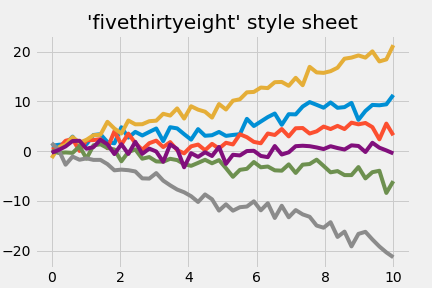

# EuroPy Test Report

## Model Card

### Model Details


**Organization**: Open Source Org (NU)

**Authors**:

* Matthew Alvarez (matt@email.com)
* Jenny Lam (jenny@email.com)
* Sundar Rajar (sundar@email.com)
* Blaine Rothrock (blaine@email.com)


**Created Date**: 2020-11-15 10:20:56.836960

**Version**: 0.0.1

**Citation**: 
```
@inproceedings{reftoken, title={EuroPy Example Title}, author={Matthew Alvarez, Jenny Lam, Sundar Rajar, Blaine Rothrock}, booktitle={Proceedings of the conference on fairness, accountability, and transparency} }
```

**Model License**: Apache License Version 2.0

**Model URL**: http://sample.com

**Data License**: Apache License Version 2.0

**Data URL**: http://sampledata.com

**Description**:

some long description

### Parameters


* **global**
	* a_global_param: 1e-06
* **test_params**
	* op1: 4
	* op2: 3
	* text_example: some text
	* list_example: 
		* 1.2
		* 1.3
		* 1.4
		* 1.5

* **not_test_params**
	* title: something that is not included


___
## Test Results

### My example bias test

Lorem ipsum dolor sit amet, consectetur adipiscing elit.


**Labels**: `bias`

**Results**: (Success: False)


___
### My example fairness test that fails


**Labels**: `bias`, `fairness`

**Results**: (Success: True)


___
### example_figure


**Labels**: `bias`

**Results**: (Success: True)

#### Figures





___


